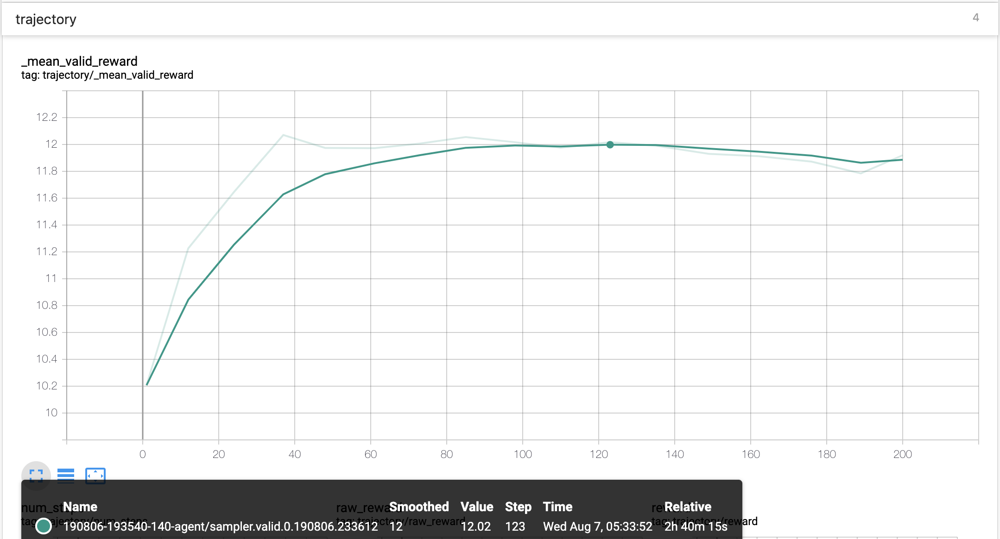

# [NeurIPS 2019: Learn to Move - Walk Around](https://www.aicrowd.com/challenges/neurips-2019-learn-to-move-walk-around) <br/> [Catalyst](https://github.com/catalyst-team/catalyst) starter kit

## Environment setup.
(Taken from the official [repo](https://github.com/stanfordnmbl/osim-rl)).

**Anaconda** is required to run our simulations. Anaconda will create a virtual environment with all the necessary libraries, to avoid conflicts with libraries in your operating system. You can get anaconda from here https://docs.anaconda.com/anaconda/install/. In the following instructions we assume that Anaconda is successfully installed.

For the challenge we prepared [OpenSim](http://opensim.stanford.edu/) binaries as a conda environment to make the installation straightforward

We support Windows, Linux, and Mac OSX (all in 64-bit). To install our simulator, you first need to create a conda environment with the OpenSim package.

On **Windows**, open a command prompt and type:
```bash
conda create -n opensim-rl -c kidzik opensim python=3.6.1
activate opensim-rl
```

On **Linux/OSX**, run:
```bash
conda create -n opensim-rl -c kidzik opensim python=3.6.1
source activate opensim-rl
```

These commands will create a virtual environment on your computer with the necessary simulation libraries installed. Next, you need to install our python reinforcement learning environment. Type (on all platforms):
```bash
conda install -c conda-forge lapack git
pip install osim-rl
```


### Basic usage

To execute 200 iterations of the simulation enter the `python` interpreter and run the following:
```python
from osim.env import L2M2019Env

env = L2M2019Env(visualize=True)
observation = env.reset()
for i in range(200):
    observation, reward, done, info = env.step(env.action_space.sample())
```


## Catalyst.RL

To train agents on the L2M environment, we can run Catalyst.RL as usual.
```bash
export LOGDIR=...
bash bin/prepare_configs.sh

# start db node
mongod --config ./configs/_mongod.conf --port 12000

# start trainer node
export GPUS=""  # like GPUS="0" or GPUS="0,1" for multi-gpu training
CUDA_VISIBLE_DEVICES="$GPUS" catalyst-rl run-trainer --config ./configs/_exp_common.yml ./configs/_dpg_common.yml ./configs/ddpg.yml

# start sampler node
CUDA_VISIBLE_DEVICES="" catalyst-rl run-samplers --config ./configs/_exp_common.yml ./configs/_dpg_common.yml ./configs/ddpg.yml

# view tensorboard logs
CUDA_VISIBLE_DEVICE="" tensorboard --logdir=./logs
```


For more information about Catalyst.RL you can check [official repo](https://github.com/catalyst-team/catalyst), [documentaiton](https://catalyst-team.github.io/catalyst/) and [examples](https://github.com/catalyst-team/catalyst/tree/master/examples/rl_gym).

## Results

After a while you can see something like

This shows us mean validation reward based on 64 episodes.


I hope this agent is only the beginning of you RL path and you can do much better.

Enjoy the competition!